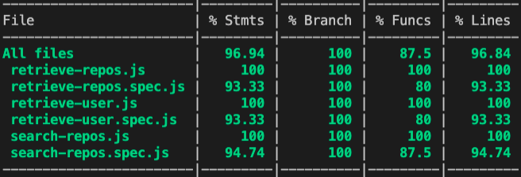

# Just a Simple GitHub Clone

## Description

I've made a GitHub profile browser with a GitHub clone display were you can:

- View User Repositories
- View User Profile info
- Find Repositories by name with the search bar
- Redirect to Repo by clicking on it

## Code Coverage

